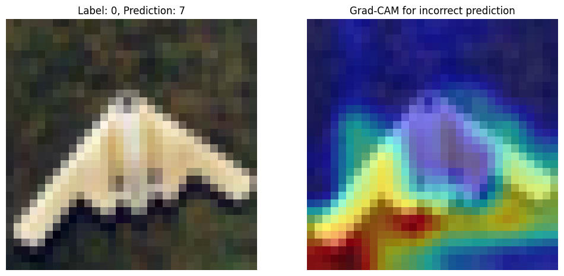
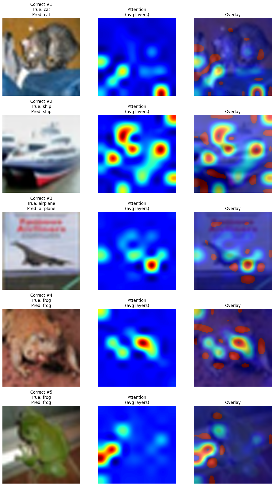

# ViT vs CNN on CIFAR-10

[](https://www.python.org)
[](./LICENSE)

Side-by-side comparison of a Vision Transformer and a small
convolutional network on CIFAR-10, with Grad-CAM heatmaps for the CNN
and attention-rollout maps for the ViT so you can see *what each model
looks at*, not just which one gets a higher number.

## What this repo does

- Train **SimpleCNN** or **ViT** on CIFAR-10 with a single CLI flag.
- Use a fixed-seed, stratified 80/20 train/val split (sklearn).
- Log metrics + checkpoints to **Weights & Biases**.
- Generate **Grad-CAM** overlays for the CNN and **attention maps**
  for the ViT to compare inductive biases qualitatively.

## Quick start

```bash
python -m venv .venv
source .venv/bin/activate
pip install -r requirements.txt

# CNN
python train.py --model cnn --epochs 10

# ViT
python train.py --model vit --epochs 10
```

`wandb login` is required on first run. Override the W&B project name
in `train.py` if you do not want runs split into `CNN-CIFAR10` /
`ViT-CIFAR10`.

## Layout

```
train.py                       Lightning entry point (CLI: --model cnn|vit)
src/
  models/
    cnn.py                     SimpleCNN (3 conv blocks + classifier)
    vit.py                     ViTLightningModule wrapper
  utils/
    data_loader.py             CIFAR-10 stratified 80/20 split
    interpretation.py          Grad-CAM and attention rollout helpers
outputs/figures/               Sample interpretability outputs
```

## Sample outputs

| Grad-CAM (CNN)                       | Attention map (ViT)                       |
| ------------------------------------ | ----------------------------------------- |
|     |     |

## CLI

```
python train.py --model {cnn,vit} --epochs INT --batch_size INT --lr FLOAT
```

Defaults: `--model vit --epochs 10 --batch_size 64 --lr 1e-3`.

## License

MIT — see [LICENSE](./LICENSE).
